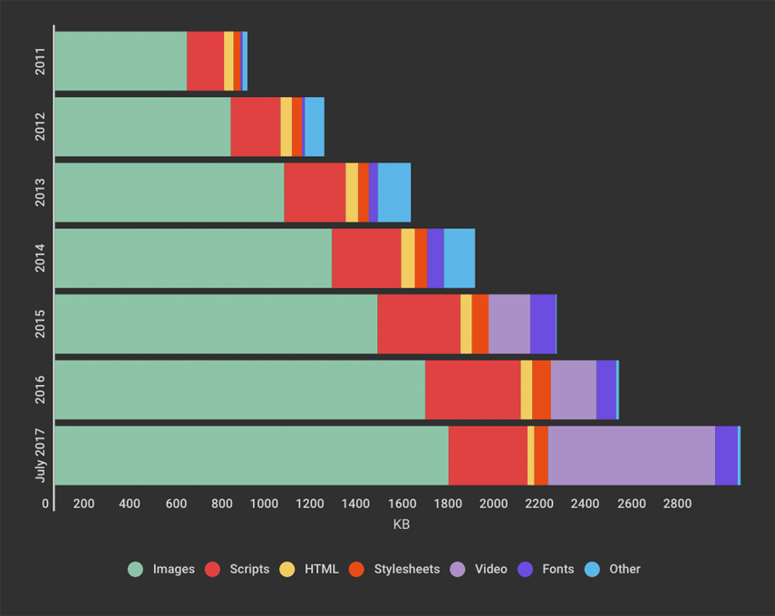

### More content on the way

In this section, _Packets_, we'll look at the environmental impact associated with sending data to our users. We have three main kinds of factors that affect how much CO2 is emitted at this point, ordered by how much control we typically have over them:

- how clean is the energy powering the infrastructure we send our data over?
- how much energy did it take to send that data?
- how much data did we send?

Next we'll run through some of the techniques we have available to us, to control these factors.

## How clean is the energy powering the infrastructure?

In short, CO2 emissions occur whenever we generate electricity, and we haven't used renewable energy to do so.

And right now, about majority of the energy used to power the the servers that run the web comes on fossil fuels. Historically the most common fossil fuel we've used has also been coal, which about the worst fuel we could be burning, environmentally speaking.

It's been chosen before largely because it's cheap, and within relatively easy access, but it kills more people per kilowatt hour than any other commonly used fuel[^killer-coal], emits more radioactive matter than any other fuel[^radioactive-coal] ([including nuclear][more-than-nukes]), and in most cases, emits the most carbon dioxide per unit of electricity.

In general, burning it for electricity is bad news for our future.

It's not the only fossil fuel in common use. Depending on which country you live in, there may be natural gas in the mix (especially in the UK), which burns cleaner, and can often be cheaper, but again still ends up emitting CO2 for each unit of electricity generated.

Oil, is somewhere between the other two main fossil fuels, and it's common for datacentres to maintain stocks of fuel oils, like diesel, in case of power outages on the national grid.

Generally speaking, if we want to generate electricity without emitting CO2 in the process, renewables are the way to go, and this is where the internet can claim a success story: the internet giants like Amazon, Google, and Apple have been a significant driver in renewable purchases globally, in recent years.

In the summer of 2017 Apple's [1.5 US dollar billion green bond made history][apple-green-bond] as the largest ever bond issued by a corporation, and in 2016, Google became [the world's largest corporate purchaser of renewables][google-largest-purchaser], as it continued its run of investment in power for its datacentres.

While this sounds like good news from the tech giants, we don't just rely on them to get data to our devices.

There's usually a whole range of other organisations that make up the internet, like the internet service providers who give us broadband connections to our home, and cellular providers whose 4G connections we use to access the internet, to hosting companies, internet exchanges, who often haven't made the same investments in renewables, and still run largely on whatever a mix of fuels is the norm for the region.

[^killer-coal]: Particulate matter from burning coal causes various respiratory problems, confirmed by many studies. This piece in [Scientific American is very accessible](https://www.scientificamerican.com/article/the-other-reason-to-shift-away-from-coal-air-pollution-that-kills-thousands-every-year/)

[^radioactive-coal]: As coals is burned, various [radioactive materials end up concentrated in the fly ash](https://nicholas.duke.edu/about/news/radioactive-contaminants-found-coal-ash). This often ends up in ponds of landfill sites.
[more-than-nukes]: https://www.scientificamerican.com/article/coal-ash-is-more-radioactive-than-nuclear-waste/

[google-largest-purchaser]: https://www.triplepundit.com/2016/03/google-became-worlds-largest-corporate-purchaser-renewable-energy/
[aws-windfarms]:https://awsinsider.net/articles/2016/11/01/aws-ohio-wind-farm.aspx
[apple-green-bond]: https://www.bloomberg.com/news/articles/2017-06-13/apple-issuing-a-second-green-bond-to-finance-clean-energy

### Energy mix around the world

The mix of energy that goes into generating electricity differs wildly depending on where you are in the world - this is sometimes down to geography, and sometimes it's down to policy decisions made by a region's government.

You can see this particularly clearly with the [electricity map project][electricity-map] - an open source interactive map, showing in realtime the energy mix (i.e. the different methods of power generation used) powering the national grids that various countries rely on.

[electricity-map]:http://electricitymap.org/

When we look at this map, it gives us an idea of how clean the emissions are likely to be, on average for a country - for example we can see that in France, with its heavy reliance on nuclear energy, generating a kilowatt hour of electricity than Poland, which is heavily invested in coal.

When we use an infrastructure provider's network to send data, and they haven't made public statement about how they are powering their infrastructure, we can assume they are either using a power mix similar to the average for the region.

#### So, what can we do with this?

Right now, you can use this to get a rough idea of how CO2-intensive moving data around in your country would be, compared to elsewhere. If you were trying to work out the carbon footprint of sending a say, a gigabyte of data, and you had an idea of how much of the impact was happening in each country, you might use this as an input.

This _may_ be interesting, but if you're not in the business of running network infrastructure for yourself, you don't have much direct, measurable control over the energy mix of the infrastructure you rely on.

You may have indirect control - like switching ISP or mobile provider in favour of a greener one if this information was available in some meaningful way. Otherwise you might lobby the providers themselves to use renewable power, or your government for this.

Right now, this isn't really an area we have much leverage, but it's worth being aware of it. and moving to the next factor.

<!--
##### Working out a footprint, hop to hop

It's plausible that we could use this knowledge to work out how much CO2 would be emitted when sending data along a given route, based on which regions the data is sent along, and then route data accordingly through greener regions. It might work along these lines:

Let's start with a simple example. If we lived in Iceland (which is overwhelmingly powered by renewables), and we visited a website hosted on servers based in Iceland, it would be reasonable to assume that we could just use figures for the country's energy mix.

However, the internet is international, and in most cases, a site will end up relying on services from organisations based in a range of countries.

If we know how much of data being sent along from each service, we can make some assumptions about the comparative emissions intensity of sending that data.

If we go back to our earlier example, we would expect that generating a kilowatt hour to run network infrastructure in Poland for data to travel along emits more CO2 than doing the same in France, because of Poland's reliance on coal.

NB: At present there aren't publicly available tools that perform these calculations, but it is possible to:

- a) work out the hops across a network that were used to access a site, and
- b) match up the majority of hops to a country
- c) look up the CO2 intensity per country to get an idea of how much CO2 would be emitted powering the infrastructure to move data to the next hop along the way
- d) combine the numbers

_(Author's note - I'm not aware of anywhere that does this yet)_ -->

## How much energy did it take to send that data?

The next factor we might look at would be how energy intensive the method used for sending that data might be.

In most cases, this will boil down to the answers of two questions, which we have slightly more control over:

- could we get the data from somewhere closer than original source?
- what kind of networks were used to send the data?

### Getting the data from somewhere closer

If we're in London, and trying to download a cat picture from a website, based in Australia, fetching the data results in a lot of hops along a lot of networks. This means more waiting for the image to arrive, more infrastructure to power, and therefore more CO2 emitted.

If the image is being requested more than once, it's often better to cache it somewhere geographically closer, and fetch it from there, rather than from the other side of the planet.

This is general idea behind content delivery networks (CDN). Companies like Akamai, who run these, buy server space in thousands of datacentres around the world, and in the case of our cat picture, they store copies of it on their servers, ready for for the next request.

The goal of a CDN is usually performance, but they also offer a degree of redundancy if the original source has gone down, and increasingly, they can serve files in compressed or optimised forms, reducing the bandwidth needed to receive a file.

In addition, another more common way to fetch data from somewhere closer is to actually store the it locally once it's been requested once.

While most browsers do this by default now, and increasing number of applications are designed to work offline, and with much more sophisticated strategies to avoid making unnecessary requests.

On the web, the browser vendors like Google and Mozilla are making a concerted effort in this direction under the _progressive web app_, allowing special support in their browsers.

So, where we can access a file, or data in a form that's closer to us is one thing that affects how expensive (in energy, emissions and [frequently money][^what-does-my-site-cost]).

[^what-does-my-site-cost]: https://whatdoesmysitecost.com is a site that will show you how much your site costs to access on a range of mobile networks around the world. It's useful when when speaking to stakeholders about performance and pageweight.

### What kind of networks do we use to send the data?

The other main factor, is the _kind of connection_ used - whether we're using what is usually termed a _fixed connection_ to a home or office (wifi, when connected to a broadband connection is still considered fixed, because it's so short range) or whether we're using a wide area, _cellular connection_ like a 3G, or 4G, or even 5G data plan from a telecoms company.

It might not surprise you to learn that sending data over a wired connection is more efficient than over a cellular one (we use wires because they _conduct_ electricity, after all…), but there's more to it than that.

#### 3G, vs 4G

Cellular 3G or 4G connections use differing amounts of energy to move the same data. 4G connections tend to need more energy per connection - you might have suspected this when you saw your phone battery draining faster when using 4G, there's research to back this up, and this quote [Digital Power Group's _The Cloud Begins with Coal_ report][report-cloud-begins-with-coal] gives an idea of just how much more:

> The new high-­‐speed LTE networks that accelerate the mobile Internet require up to three times more data per hour per task compared to the previous slower 3G networks, and thus more energy. And compared to 2G networks, LTE energy consumption is 60 times greater to offer the same coverage.

[cisco-visual-reporting]: https://www.cisco.com/c/en/us/solutions/collateral/service-provider/visual-networking-index-vni/mobile-white-paper-c11-520862.html
[power-of-wireless-cloud]:(https://hypothes.is/a/EnM6usXvEeeUPrvepxL80A)
[report-cloud-begins-with-coal]:(https://via.hypothes.is/https://www.tech-pundit.com/wp-content/uploads/2013/07/Cloud_Begins_With_Coal.pdf#annotations:EnM6usXvEeeUPrvepxL80A)

#### Why this happens

It's briefly worth discussing why this happens.

When you have few people using a network, it's possible to transmit cellular signal at a lower frequency, which for the same power, gives a you relatively long range. The trade off is that you can't send much data over this quickly, nor have many connections. As ever, it's more complicated than this, but you can think of 2G and 3G connections making this trade-off compared to what we typically think of as 4G.

When you have more people using a network, to provide the same level of service, one approach is to transmit a signal at a higher frequency. With a higher frequency, more people can use the same network, at a relatively fast rate, but the trade-off is that the range for each transmitter is low, and signals are more easily blocked by large solid objects. So, you end up needing more transmitters to make up for the reduced range. When we talk about 4G being faster than 3G, and supporting more users in the same area, but using more energy, this is the trade-off being made.

#### The other reason for using more energy. More use!

The other reason is more down to our behaviour - faster connections tend to offer a better user experience, and better user experiences often result in more use.

You can see this in [Cisco Systems' Visual Networking report][cisco-visual-reporting] shows how 4G networks increasingly represent the bulk of mobile data being transferred now:

> Although 4G connections represented only 26 percent of mobile connections in 2016, they already accounted for 69 percent of mobile data traffic, while 3G connections represented 33 percent of mobile connections and 24 percent of the traffic. In 2016, a 4G connection generated four times more traffic on average than a 3G connection.

#### 5G and beyond

5G promises faster still connections, and supporting more users in the same area, at the cost of needing many, many more base stations, and using more energy.

To give some context, in the UK, a typical UK mobile provider uses around 17,000 base stations to provide coverage, to provide a mix of 3G and 4G coverage.

For the shift to 5G, Mentor, a telecoms focussed management consultancy is [predicting a shift to using 50,000 base stations over 5 year for the same area][mentor]. This is _per operator_, and with 4 main operators in the UK, we end up with around 200,000 energy hungry base stations needed to provide coverage alone, where we had around 65,000 before.

Even if these used the same energy per base station as earlier ones did, just having four times as many base stations to serve less than four times as many people, means higher greater energy demand per user.

[mentor]: https://mentoreurope.com/resources/blogs/dark-fibre-and-the-positive-impact-on-5g-deployment/

#### What this shift to wireless/cellular means

If you make digital products, or websites, what this means is that as a greater proportion of your users use your products over mobile cellular connection, getting data to them becomes more energy intensive.

Unless there's an explicit commitment to renewables from the infrastructure provides, this means greater CO2 emissions.

### So, what can we do with this?

Like the energy mix of the network infrastructure we rely on, we have limited control over what kind of network a user might rely on to use the digital products we make.

If we provide devices as part of a service to users we have some scope for controlling this, but this is comparatively rare.

Mostly, it gives us:

- a good reason to ask our phone providers to shift more towards using renewables to power their infrastructure
- some extra context over what we have the most control over - the data we send

## How much data did we send?

When we don't have direct control over the the infrastructure, and less control over how the products we make are accessed, we are left with one thing we _do_ have control over - the amount of data we send to users.

However, as an industry, not only are users using the products we make more, but we're also sending more ever more data to each user, when they do the same tasks as before.

### The web page obesity crisis

One way to see this is by looking at sizes of the pages we visit in our browsers and our touch devices. We can turn to the HTTP archive, a publicly available dataset of the top 1 million pages for this, and various datasets about their size, content type and so on.

In August 2017 [Tammy Everts, the author of _Time Is Money -
The Business Value of Web Performance_ ][speed-curve-page-blog], shared some analysis of the pageweight of sites in the HTTP Archive over time.

[speed-curve-page-blog]:https://speedcurve.com/blog/web-performance-page-bloat/

This graph shows that the average (i.e. the mean) page weight is growing by around 16% year on year - in 2011, total pageweight was less than a megabyte. By August 2017, it had tripled, to larger than 3mb per page[^mean-not-median].

While the majority of this growth has come from ever more images in use, more recently we're seeing the increased use of video on webpages affecting page weight.

So we've established now, that we're not only moving to a more energy intensive way to shift data, but the pages we visit are getting larger, so we're moving more data, in a way that emits more CO2.

[^mean-not-median]: It's worth acknowledging that the mean page size shown here is arguably a bit misleading, as a few ginormous pages skew the mean page weight upwards. Video does increase size, but it's not as bad as this initially graph suggests. Tammy recognises this in the conversation on the post.

### Beyond HTML and CSS - putting this in context

Before we start feeling terrible about badly our optimised webpages and web-apps destroying the planet, and it's worth looking at how connectivity is used outside of the web, to get some perspective.

Over the last 5 years, video in particular has become the largest consumer of bandwidth, for cellular and for fixed connections, and it's foolish to talk about the subject of CO2 emissions of internet use without it.

##### How we download over fixed connections to our homes

This table below from [Sandvine's 2016 Global Internet Phenomena][sandvine-report] report, shows peak traffic usage in North America over 2016, downloaded over fixed connections:

| Source     | Share of downstream traffic     |
| :------------- | :------------- |
| Netflix        |  35%|
| YouTube        |  18%|
| Amazon         |  4%|
| HTTP           |  4%|
| iTunes         |  3%|
| Hulu           |  3%|
| SSL            |  3%|
| Xbox One Games Download | 2%          |
| Facebook       | 2%
| BitTorrent     | 2%

[sandvine-report]:https://www.sandvine.com/resources/global-internet-phenomena/2016/north-america-and-latin-america.html

As you can see, streaming video dominates - Amazon Video, Youtube and Netflix make up more than half of peak traffic in America. Facebook,

What we might consider web traffic, i.e. HTTP and HTTPS together, make up less than 7% now.

##### How we download over mobile

The same stats for mobile tell a slightly different story - depending on how you count it, web traffic might represents between 15% and 30% of peak download traffic[^facebook-browser-and-video].

| Source     | Share of downstream traffic     |
| :------------- | :------------- |
| YouTube | 21 % |
| Facebook | 14 % |
| HTTP - OTHER | 9 % |
| SSL - OTHER | 7 % |
| Instagram |7 % |
| Snapchat | 5 % |
| Netflix | 4 % |
| iTunes | 3 % |
| Google Cloud | 3 % |
| MPEG - OTHER | 2 % |

However, almost all the other sources are video-heavy - Youtube is a video app, Instagram uses video increasingly in its stories, as does Snapchat, as does Facebook.

[^facebook-browser-and-video]: It is not clear in this table if this is the Facebook app, or traffic to Facebook's online properties. Facebook browser has a browser built in, so traffic assigned to the the Facebook app may be click-throughs to web pages outside of Facebook itself, but the Facebook site and Facebook make extensive use of video as well now.

We can take a few things away from seeing these stats:

##### Streaming video is the largest consumer of bandwidth on desktop and mobile

It's hard to overstate how much a factor video is here in bandwidth usage.

According to Netflix, watching an hour long show in high definition (i.e. 1080p) typically uses around 3 gigabytes of data, and the equivalent to 4k video uses around 7gb per hour.  With Amazon Video, they state that their closest equivalent used around 1.4 gigabytes per hour, and just under 7k by comparison.

For perspective, downloading a gigabyte of data emits around as much CO2 as driving a mile in a family car. So watching an hour-long show at 4k emits about as much CO2 as the average daily 7.7 mile commute in America[^basic-basic-notebook].

[^basic-basic-notebook]: This figure comes from taking average commute figures for major US metro areas in [this 2015 article from Market Watch](https://www.marketwatch.com/story/here-are-the-typical-commutes-for-every-big-metro-area-2015-03-25), and taking their average.

##### In both cases, 5 publicly traded companies are responsible for more than half of the traffic

Statistically speaking we probably don't work at these companies ourselves, so don't have much direct control over them. And in many cases, they've already made commitments to run servers in their own datacentres (i.e. their platform) on renewable power.

If we wanted to reduce emissions here, we're unlikely to have much luck telling our users to stop watching video. We'd likely look to the providers of network infrastructure, and internet service providers, and lobby for them to use cleaner power, or as customers these companies to lobby the ISPs ourselves.

##### The web as we usually think of it, makes up at least a 15% of traffic on mobile, and around half that figure on desktop

If we're building a digital product or service and we're not one of the tech giants above, this is typically where we fit into this picture, and have the most influence over emissions emitted when using it.

While there are measurable environmental savings to be made by rethinking how we build apps to send less data, we shouldn't kid ourselves into thinking we're saving the planet by doing so.

Instead, it's better to think of this like you would with accessibility - it's the right thing to do, and it also leads to building products that work better - they'll tend to load faster, and when done right get out of your user's way to let them meet the needs they have.

## Revisit

So there we have it. The three main factors:

- how much data we send
- how efficiently we can make get it to a user
- and how cleanly we can generate the energy we rely on to power the infrastructure we use

----

# Steps you can take

## Make the packets green

If there was a campaign or lobbying body for greening our network infrastructure, we could decouple emissions from sending data in the first place.

At present there aren't any organisations specifically requesting this.

## Make them count

We _do_ have control over how much data we end up sending over the wire, and fortunately there is a whole industry's worth of work we can draw upon here.

### Performance budgets

#### CDNs and caching, and offline

#### Optimising what we send

https://images.guide/
